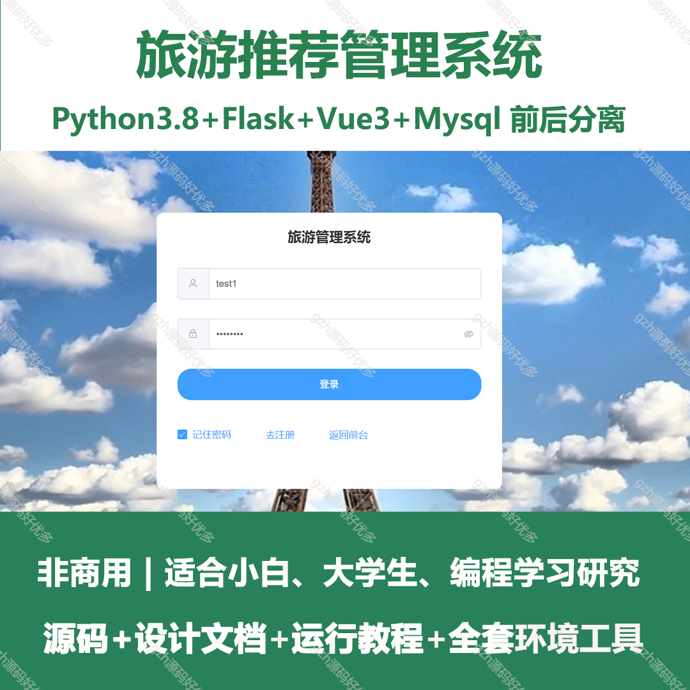
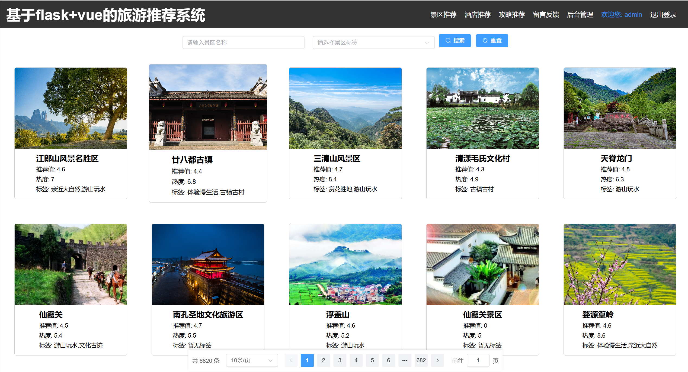
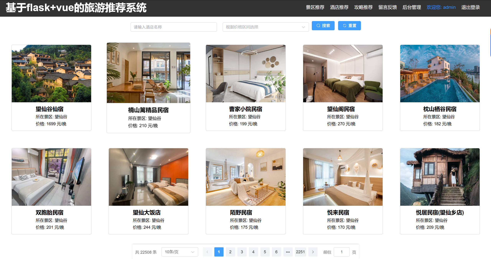
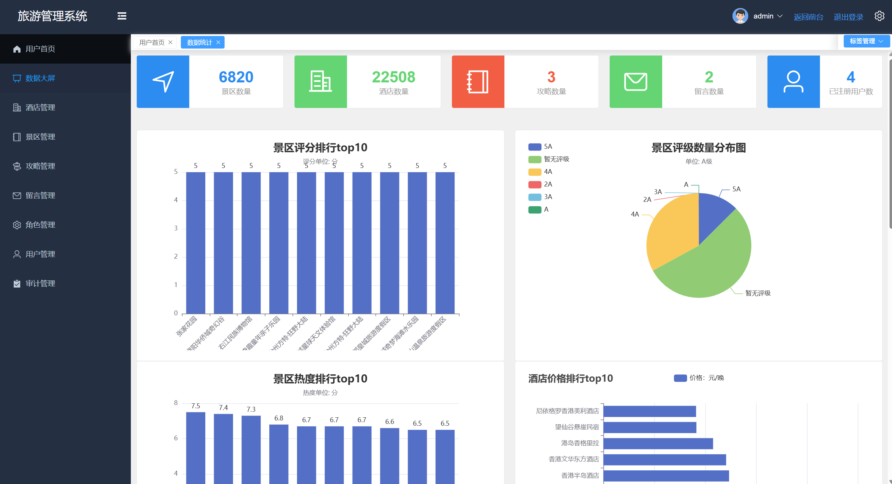
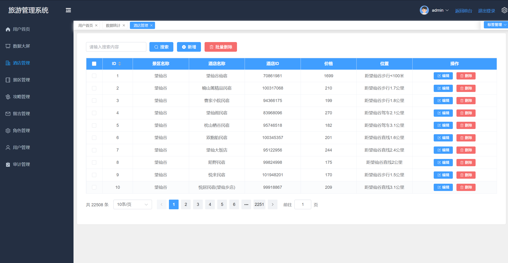
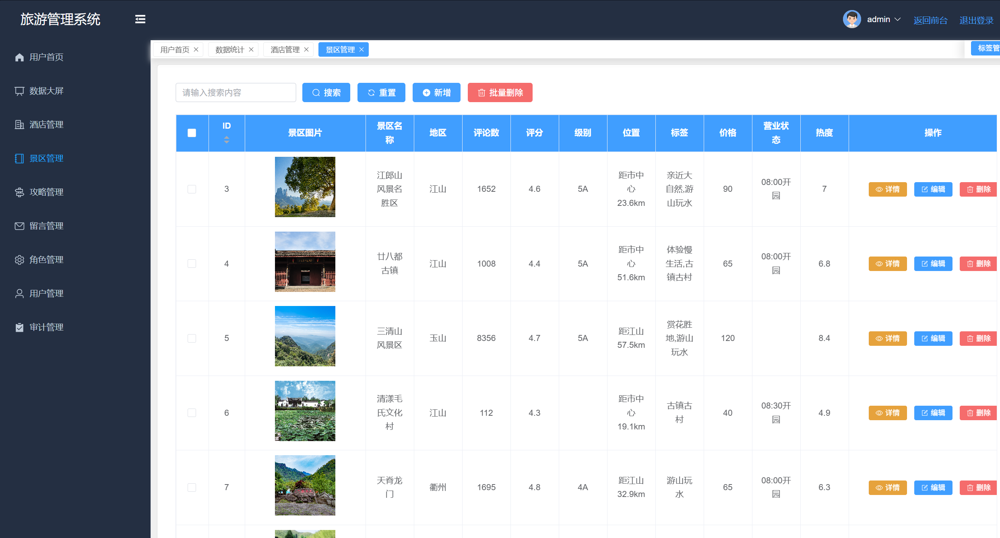
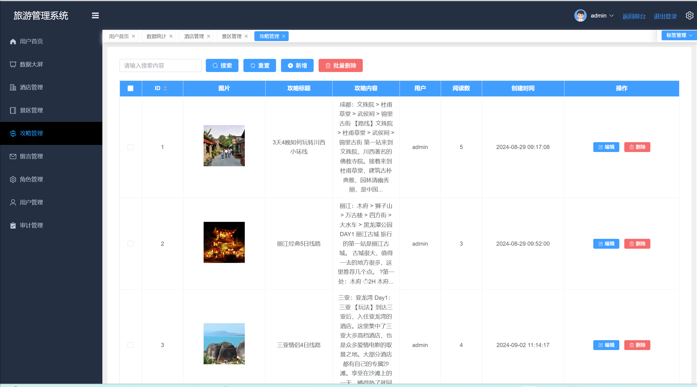
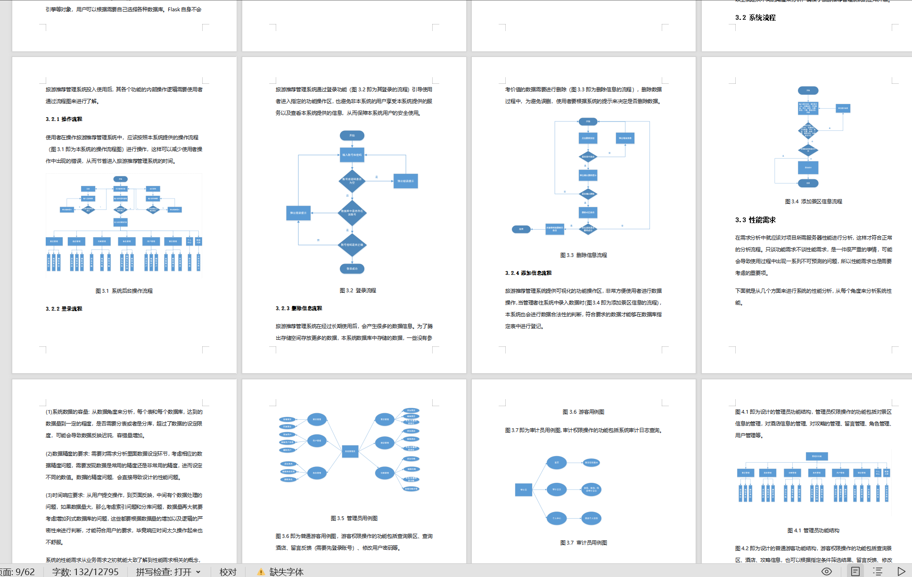
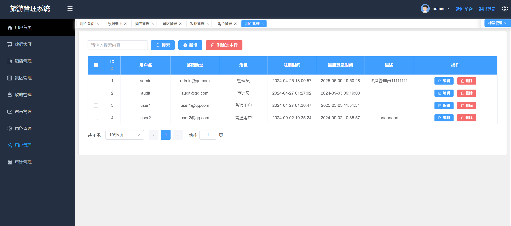

# python031
python031基于Python+Vue3的旅游推荐管理系统
 
## 查看主页获取源码

### 一、关键词

旅游推荐管理系统、旅游系统

 

### 二、作品包含

源码+数据库+万字文档+全套环境和工具资源+部署教程

 

### 三、项目技术

前端技术：Vue3 + pinia + Element Plus+Echarts+Axios
后端技术：Python3+Flask
  

 

### 四、运行环境（以下版本亲测，其他版本未知，请自测）

开发工具：PyCharm + VSCODE

数据库：MySQL8

数据库管理工具：Navicat10+

Python：Python3.8

前端Nodejs：18

浏览器：谷歌浏览器

 

### 五、项目介绍

项目编号：python031

本文档旨在描述基于 Python 和 Vue.js 技术栈开发的旅游推荐管理系统的设计与实现过程。该系统旨在为旅游从业者和旅游爱好者提供一站式的旅游信息管理和推荐服务。

系统集成了旅游景点推荐、酒店推荐以及旅游攻略的信息管理与推荐功能，支持用户搜索、筛选、收藏及评价。通过前后端分离架构，实现了高效的数据处理和良好的用户体验。
旅游推荐管理系统能够实现数据大屏，景区管理，酒店管理，攻略管理，留言管理，角色管理，用户管理，审计管理等功能

 

### 六、运行截图

